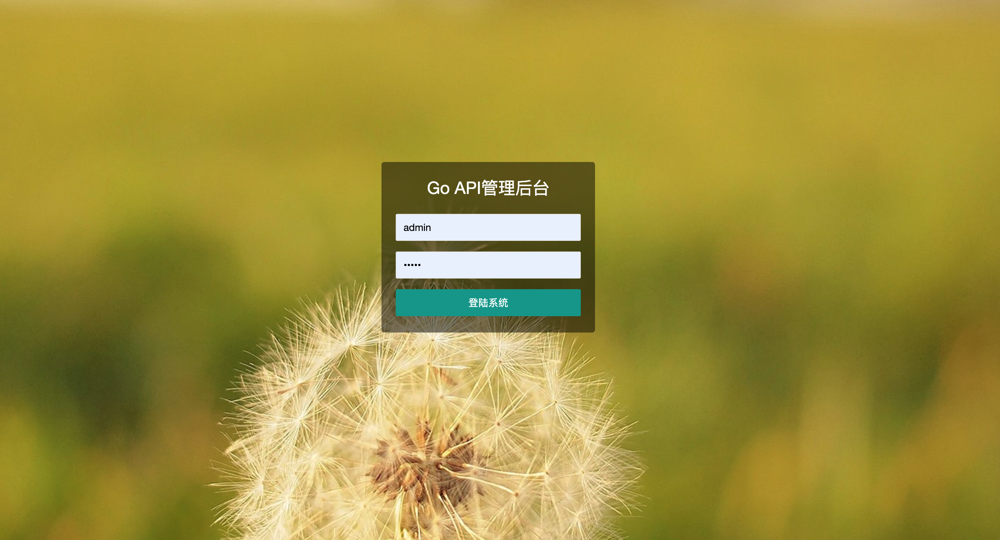
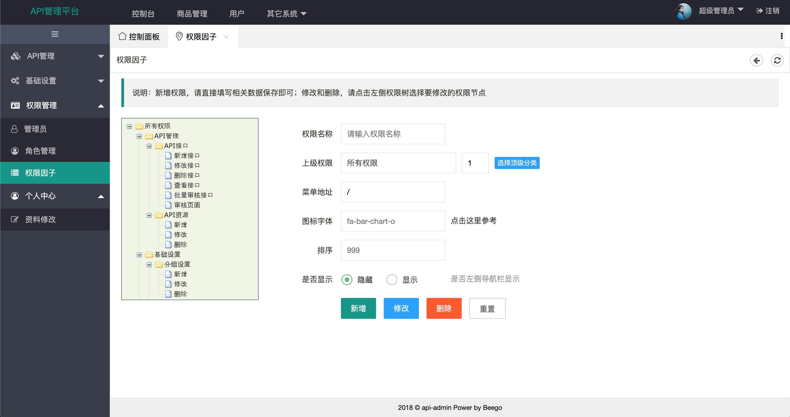
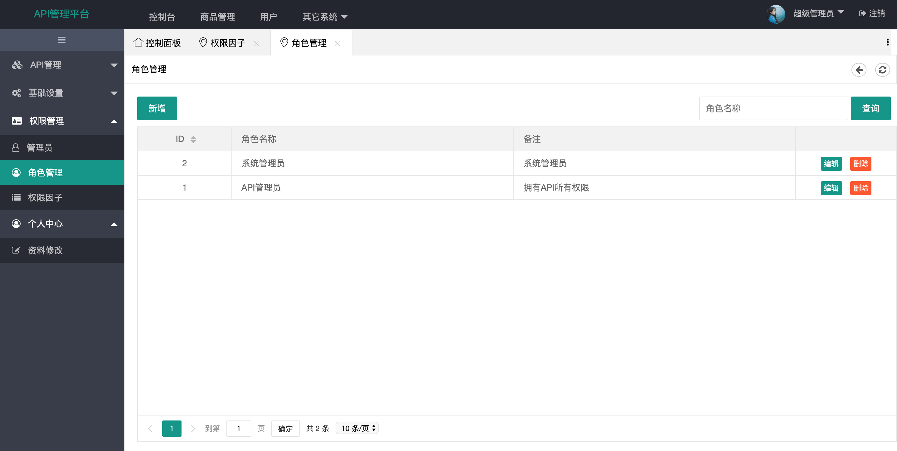
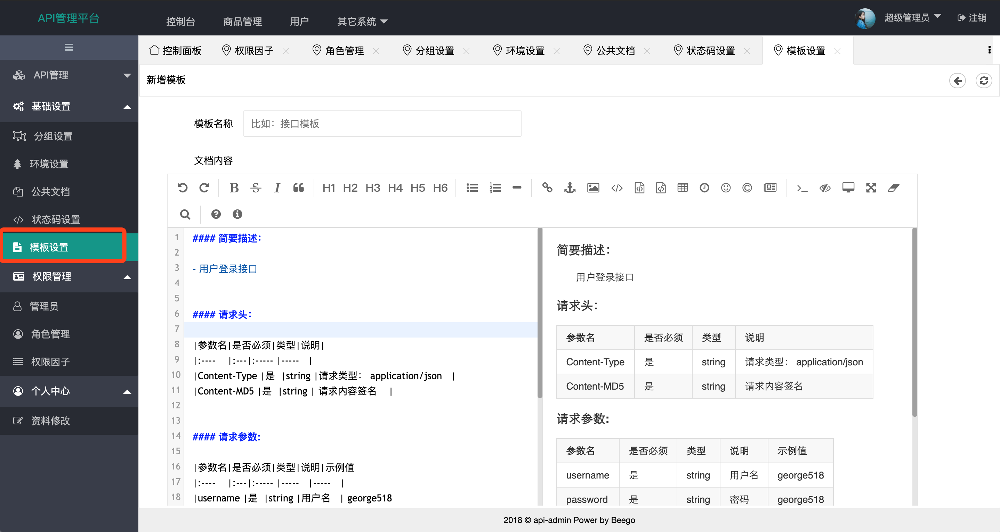
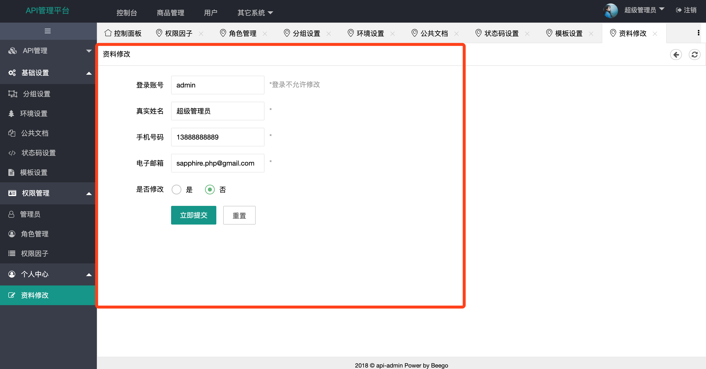

GoGin_ApiAdmin
====
### 什么东西？What?
API管理工具 golang开发，基于beego，页面基于layUi,目前版本1.0.0 

### 有什么价值？
1、RBAC权限完善，多角色管理系统 
2、后台界面完整，多标签页面 
3、API相关页面有比较复杂的使用案例 
所以，可以作为一个基础框架使用，快速开发。初学者还可以作为熟悉beego使用。 
4、可用于中小团队API管理使用 

### 用到了哪些？
1、界面框架layUI2.4.5 
2、makedown.md 
3、beego1.8
4、Ztree 


### 安装方法 

```shell
1、git clone https://github.com/chenyongze/go-api-admin.git

2、创建mysql数据库，并将./docs/db/go-api-admin.sql导入

3、修改config 配置数据库
	cp app.conf.example app.conf
	
4、运行 go run main.go

前台访问：http://127.0.0.1:8081
后台访问：http://127.0.0.1:8081/login
用户名：admin 密码：admin
```


### 效果展示
> 登录页面



>  权限界面




> 角色管理




> Markdown 编辑




> 用户资料修改

